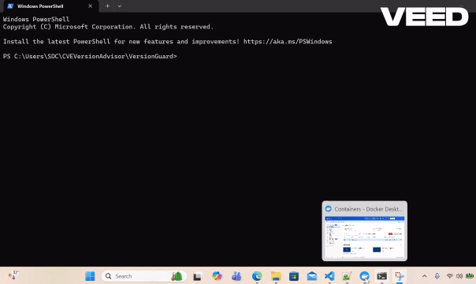
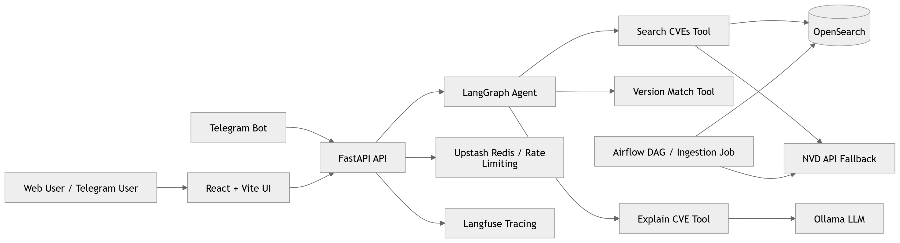

# 🛡️ VersionGuard
## Agentic CVE Advisor for Software Version Security

  <h3>“Is this version vulnerable?” → Get instant, accurate answers</h3>
  
Production-ready agentic system for CVE analysis using NVD, OpenSearch, and LLM reasoning

  
  
  
  
  

---

## 🚀 Production Ready

VersionGuard is designed as a production-ready system with:
- scalable OpenSearch indexing
- real-time NVD fallback
- rate limiting and API security
- CI/CD integration capability
- agentic reasoning with deterministic validation

---

## 🎥 Demo

---

## 🚀 What Problem Does This Solve?

Modern software depends heavily on third-party libraries.

However, engineers often struggle with **security jargon and complex CVE descriptions**.

Answering a simple question like:

Is OpenSSL 3.0.1 vulnerable?

requires:
- Searching NVD manually
- Understanding security terminology
- Parsing CPE version ranges
- Comparing versions correctly

❌ This is slow, error-prone, and difficult to interpret.

---

### ✅ VersionGuard solves this by:

- Translating CVEs into **simple, plain English**
- Accurately checking version applicability
- Providing **clear upgrade guidance**

---

## 🏗️ Architecture Diagram

---

## ⚙️ Technical Summary

VersionGuard is a production-grade **Agentic RAG system for vulnerability analysis**.

1. User input is parsed into package and version.
2. CVEs are retrieved from OpenSearch or directly from the NVD API.
3. NVD data is sourced from https://nvd.nist.gov/ using an optional NVD API key.
4. CVE configurations are parsed, including nested AND/OR CPE logic.
5. A deterministic version-matching engine evaluates applicability.
6. Only explicitly vulnerable versions are flagged as vulnerable.
7. LangGraph orchestrates tool-based reasoning across the workflow.
8. Ollama LLM generates simplified explanations from CVE data.
9. Results are returned in structured JSON for UI and API use.
10. The system supports both real-time queries and indexed search.

---

## 🛠️ Tech Stack

- FastAPI
- LangGraph
- Ollama (LLM)
- OpenSearch
- NVD API
- Airflow
- React + Vite + Tailwind
- Redis (Upstash)
- Langfuse

---

## ⚡ Quick Start

### Setup

powershell -ExecutionPolicy Bypass -File .\setup-versionguard.ps1

### Start

powershell -ExecutionPolicy Bypass -File .\start-versionguard.ps1

### UI

http://localhost:5173

### Test

openssl 3.0.1

### Optional ingestion

powershell -ExecutionPolicy Bypass -File .\ingest-versionguard.ps1

---

## 🧭 Execution Order

1. setup
2. start
3. ingest (optional, but recommended)

---

